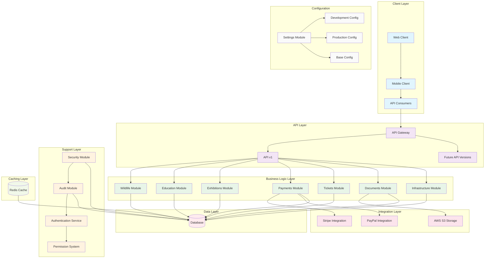

# Architecture Diagram

```mermaid
graph TB
    subgraph "Client Layer"
        A[Web Client] --> B[Mobile Client]
        B --> C[API Consumers]
    end

    subgraph "API Layer"
        C --> D[API Gateway]
        D --> E[API v1]
        D --> F[Future API Versions]
    end

    subgraph "Business Logic Layer"
        E --> G[Wildlife Module]
        E --> H[Education Module]
        E --> I[Exhibitions Module]
        E --> J[Payments Module]
        E --> K[Tickets Module]
        E --> L[Documents Module]
        E --> M[Infrastructure Module]
    end

    subgraph "Support Layer"
        N[Security Module] --> O[Audit Module]
        O --> P[Authentication Service]
        P --> Q[Permission System]
    end

    subgraph "Integration Layer"
        J --> R[Stripe Integration]
        J --> S[PayPal Integration]
        L --> T[AWS S3 Storage]
    end

    subgraph "Data Layer"
        G --> U[(Database)]
        H --> U
        I --> U
        J --> U
        K --> U
        L --> U
        M --> U
        N --> U
        O --> U
    end

    subgraph "Caching Layer"
        V[(Redis Cache)] --> U
    end

    subgraph "Configuration"
        W[Settings Module] --> X[Development Config]
        W --> Y[Production Config]
        W --> Z[Base Config]
    end

    style A fill:#e1f5fe
    style B fill:#e1f5fe
    style C fill:#e1f5fe
    style D fill:#f3e5f5
    style E fill:#f3e5f5
    style F fill:#f3e5f5
    style G fill:#e8f5e8
    style H fill:#e8f5e8
    style I fill:#e8f5e8
    style J fill:#e8f5e8
    style K fill:#e8f5e8
    style L fill:#e8f5e8
    style M fill:#e8f5e8
    style N fill:#fff3e0
    style O fill:#fff3e0
    style P fill:#fff3e0
    style Q fill:#fff3e0
    style R fill:#fce4ec
    style S fill:#fce4ec
    style T fill:#fce4ec
    style U fill:#ffebee
    style V fill:#f1f8e9
    style W fill:#fafafa
    style X fill:#fafafa
    style Y fill:#fafafa
    style Z fill:#fafafa
```